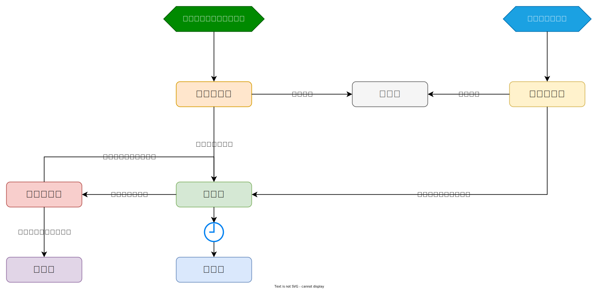

# springboot-Apartment

## 项目概述

### 项目业务概述

尚庭公寓是一个公寓租赁平台项目，包含**移动端**和**后台管理系统**，其中移动端面向广大用户，提供找房、看房预约、租约管理等功能，后台管理系统面向管理员，提供公寓（房源）管理、租赁管理、用户管理等功能。下面分别介绍两端的具体业务功能。

移动端

其主要业务功能如下图所示

各功能模块具体内容如下

- **房源检索**

  用户可以使用这个功能来搜索和检索符合其需求的房源。他们可以根据不同的条件，如地理位置、租金范围、支付方式等，快速找到适合的房源。

- **看房预约管理**

  用户可以通过这个功能预约看房。他们可以选择合适的时间，预约在特定的公寓进行实地看房，以便更好地了解房源的情况和环境。

- **租约管理**

  这个功能允许用户查看和管理他们的租约信息。他们可以在移动端查看租约合同，以及提交租约终止或延长的请求。

- **房源浏览历史**

  用户可以在这里查看他们曾经浏览过的房源历史记录。这个功能可以帮助用户追踪之前感兴趣的房源，方便他们重新查看或做出决策。

### 后台管理系统

主要业务功能如下图所示

各功能模块具体内容如下

- **公寓信息管理**

  这个模块负责管理所有公寓的基本信息，包括公寓名称、地址、联系方式等。管理员可以在这里添加、编辑、删除公寓信息。

- **房间信息管理**

  该模块负责管理每个公寓内各个房间的详细信息，包括房间号、户型、面积、租金等。管理员可以在这里进行房间信息的添加、编辑和删除。

- **公寓/房间属性管理**

  这个模块允许管理员定义公寓和房间的各种属性，比如公寓和房间的配套设施，方便管理员在维护公寓信息和房间信息时进行选择。

- **看房预约管理**

  该模块用于管理用户的看房预约请求。用户可以在移动端提交看房预约，管理员可以在后台管理系统中查看和处理这些请求，以方便安排人员接待用户。

- **租约管理**

  这个模块用于管理租约的创建、修改和终止。管理员可以在这里生成租约合同，并发送给用户签约。

- **后台系统用户管理**

  该模块用于管理后台系统的用户账户信息，管理员可以创建、编辑、删除、禁用账户信息。

- **移动端用户管理**

  这个模块负责管理移动端用户的信息。管理员可以查看用户信息，处理账户相关问题。

### 核心业务流程

本项目的核心业务流程为签约、续约、退租，具体流程如下图所示

在上述的业务流程中，会涉及到租约状态的多次变化，下面详细介绍一下租约状态。租约共有7个状态，分别是`签约待确认`、`已签约`、`已取消`、`已到期`、`退租待确认`、`已退租`、`续约待确认`，以下是这些状态的变化流程。

## 项目技术概述

本项目的技术架构如下图所示。

项目采用前后端分离的模式，下面介绍各模块用到的技术。

- **前端**
  
  - 框架：VUE3
  
- **后端**
  
  - 框架：Spring Boot
  
  - 数据库访问：MyBatis、MyBatis Plus
  
    > MyBatis-Plus（简称 MP）是一个MyBatis的增强工具，在 MyBatis 的基础上只做增强不做改变，为简化开发、提高效率而生。
  
  - Web：Spring MVC
  
- **数据存储**
  - 关系型数据库：MySQL
  
  - 缓存：Redis
  
  - 对象存储：MinIO
  
    > **对象存储**是用于存储非结构化数据的数据存储架构，它将一个数据单元称为一个对象，每个对象都包含数据本身、元数据（描述数据的信息）和一个唯一标识符（通常是一个URL地址）。
    >
    > 在2001年，亚马逊推出了Simple Storage Service（简称S3），这是第一个商业化的、面向互联网的对象存储服务。随后国内众多云服务厂商也都推出了自己的对象存储服务，例如阿里云的OSS，华为云的OBS，百度云的BOS等等。
    >
    > **MinIO**是一个开源的对象存储方案，兼容亚马逊S3协议。
    >
    > 对于对象存储，我们可以选择直接购买各大云厂商提供的服务，也可以选择使用开源的服务，自行安装和维护。本项目采用开源的对象存储Minio来存储图片信息。
  
- **部署**
  
  - 前端服务器：Nginx
